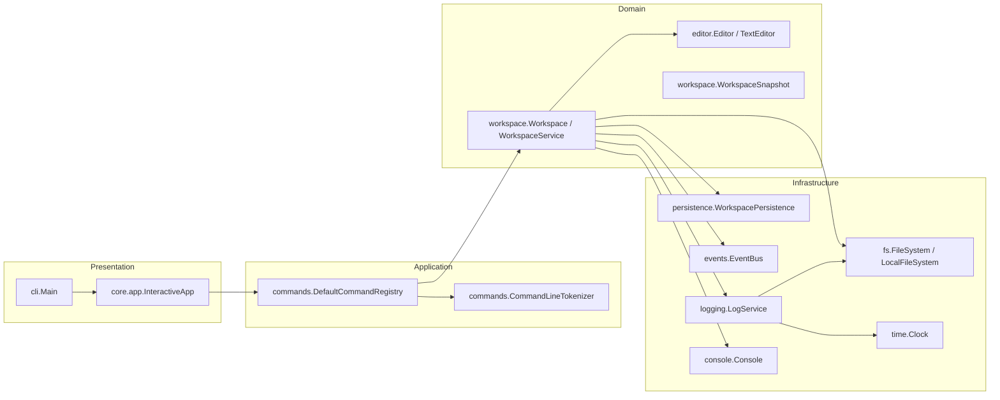

# Lab1 设计文档（Java）

本文档按 `lab1.md` 的提交要求组织：系统架构、核心设计、运行说明、测试文档。

## 2.1 系统架构

### 模块划分图

### 模块职责说明

- **CLI 交互层（`Main` + `InteractiveApp`）**
  - 循环读取用户输入并交给命令层执行。
  - 根据 `ExecutionResult` 判断是否退出。
- **命令层（`DefaultCommandRegistry`）**
  - 解析命令行文本，分发到具体工作区接口。
  - 命令成功执行后发布 `CommandExecutedEvent`，供日志模块订阅。
- **工作区层（`WorkspaceService`）**
  - 维护打开文件集合、当前活动文件、MRU 最近使用顺序。
  - 协调 `load/save/init/close/edit/editor-list/dir-tree/undo/redo/exit` 等命令。
  - 协调 `append/insert/delete/replace/show/spell-check` 等编辑命令。
  - 负责状态持久化与恢复（打开文件、活动文件、modified、日志开关）。
- **编辑器层（`TextEditor`）**
  - 使用 `List<String>` 作为文本存储结构。
  - 实现 `append/insert/delete/replace/show`。
  - 每个编辑器实例独立维护 undo/redo 栈。
  - 通过装饰器叠加日志开关等增强能力。
- **基础设施层**
  - `FileSystem`：文件读写、目录遍历、路径规范化。
  - `WorkspacePersistence`：工作区快照持久化（`.properties`）。
  - `LogService`：写入/显示 `.filename.log`，处理会话头与日志开关。
  - `EventBus`：发布/订阅命令执行事件。

### 模块依赖关系（依赖倒置）

- 上层依赖接口，不依赖具体实现：
  - 命令层依赖 `Workspace` 接口。
  - 工作区层依赖 `FileSystem`、`WorkspacePersistence`、`LogService`、`Console`、`EventBus` 接口。
- 具体实现替换成本低：
  - 测试中使用 `FakeConsole`、`FakeClock` 即可替换交互与时间依赖。

### 与实验功能点的对应关系

- **工作区模块要求**：由 `WorkspaceService` + `WorkspaceSnapshot` + `PropertiesWorkspacePersistence` 完成。
- **编辑器模块要求**：由 `TextEditor` 完成，按行存储并支持编辑命令与边界检查。
  - 装饰增强由 `EditorDecorator` 链完成。
- **日志模块要求**：由 `WorkspaceLogService` + `EventBus` 完成，支持自动开启、开关与展示。

## 2.2 核心设计

### 设计模式应用说明

- **备忘录模式（Memento）**
  - `WorkspaceSnapshot` 作为工作区状态快照对象。
  - `PropertiesWorkspacePersistence` 负责快照落盘与加载。
  - 持久化内容：打开文件列表、活动文件、modified、日志开关。
  - 不持久化内容：undo/redo 历史。
- **观察者模式（Observer）**
  - 命令执行后发布 `CommandExecutedEvent`。
  - 日志模块订阅事件并写日志，解耦命令执行与日志写入。
- **命令/撤销重做思想**
  - `TextEditor` 用 before/after 快照记录一次编辑，维护 undo/redo 栈。
  - 每个文件（编辑器实例）独立维护历史，满足实验要求。
- **装饰器模式（Decorator）**
  - 使用 `EditorDecorator` 作为装饰器基类统一委托 `Editor` 行为。
  - `LoggableEditorDecorator` 负责日志开关增强（`isLogEnabled/setLogEnabled`）。
  - `WorkspaceService.decorate(...)` 组装装饰链：`TextEditor -> LoggableEditorDecorator`。

### 设计模式在代码中的落点

#### 1) 命令模式（Command）

- **命令接收者与分发器**：`edu.lab.core.commands.DefaultCommandRegistry`
  - `registerAll()`：将命令字符串映射到处理函数（如 `load -> handleLoad`、`append -> handleAppend`）。
  - `execute(String rawLine)`：统一解析并分发命令，相当于命令调用入口。
- **命令执行目标（Receiver）**：`edu.lab.core.workspace.Workspace` / `WorkspaceService`
  - 命令处理器最终调用 `workspace.load/save/append/...` 完成业务动作。
- **与撤销重做结合**：`edu.lab.core.editor.TextEditor`
  - `applyEdit()` 记录一次编辑前后快照，`undo()/redo()` 回放历史。

#### 2) 备忘录模式（Memento）

- **备忘录对象**：`edu.lab.core.workspace.WorkspaceSnapshot`
  - 封装工作区可持久化状态（打开文件、活动文件、modified、日志开关）。
- **发起人（Originator）**：`edu.lab.core.workspace.WorkspaceService`
  - `snapshot()`：从当前内存状态生成快照。
  - `restore()`：从快照恢复运行状态。
- **管理者/存储者（Caretaker）**：`edu.lab.core.persistence.PropertiesWorkspacePersistence`
  - `save(WorkspaceSnapshot)` / `loadOrEmpty()`：负责快照落盘与读取。

#### 3) 观察者模式（Observer）

- **主题/事件总线**：`edu.lab.core.events.EventBus`、`SimpleEventBus`
- **事件类型**：`edu.lab.core.events.CommandExecutedEvent`
- **发布者**：`edu.lab.core.commands.DefaultCommandRegistry`
  - `okAndPublish()/exitAndPublish()/publish()` 在命令成功后发布事件。
- **订阅者**：`edu.lab.core.workspace.WorkspaceService` 构造函数中订阅 `CommandExecutedEvent`
  - 收到事件后检查目标文件是否开启日志，调用 `logService.logCommand(...)` 写日志。

#### 4) 装饰器模式（Decorator）

- **装饰器基类**：`edu.lab.core.editor.EditorDecorator`
  - 默认把 `Editor` 接口全部方法委托给 `delegate`。
- **具体装饰器**
  - `edu.lab.core.editor.LoggableEditorDecorator`：维护日志开关状态。
- **装配位置**：`edu.lab.core.workspace.WorkspaceService.decorate(Editor core)`
  - 在 `load/init/restore` 创建编辑器时统一套装装饰器链。

### 关键设计决策

- **文本参数转义策略**
  - 仅对文本参数解码 `\n` 等转义，避免误伤 Windows 路径中的反斜杠。
- **日志容错策略**
  - 日志读写失败输出 warning，不中断主流程（符合实验要求）。
- **恢复 modified 的一致性策略**
  - 恢复时按快照还原 modified 标记，保证“退出前未保存”状态可被正确恢复。

### 命令实现清单

#### 工作区命令（10个）

- `load`
- `save`
- `init`
- `close`
- `edit`
- `editor-list`
- `dir-tree`
- `undo`
- `redo`
- `exit`

#### 文本编辑命令（5个）

- `append`
- `insert`
- `delete`
- `replace`
- `show`

#### 额外增强命令（不计入 Lab1 必做 18 个命令）

- `spell-check`

#### 日志命令（3个）

- `log-on`
- `log-off`
- `log-show`

## 2.3 运行说明

### 运行环境

- JDK：17+
- 构建工具：Maven 3.9+
- 编码：UTF-8

### 安装依赖

本项目依赖由 Maven 自动下载，无需手动安装第三方库。

### 运行程序命令

- `mvn package`
- `java -jar target/lab1-cli-editor-1.0.0.jar`

### 运行测试命令

- `mvn test`

### 2.4 测试文档

- **命令层**
  - `CommandLineTokenizerTest`：验证分词、引号处理与基础转义（如 `\n`）。
  - `DefaultCommandRegistryTest`：验证未知命令处理、参数缺失校验。
  - `CommandChecklistRegressionTest`：核心命令清单回归，确保 18 个命令全部注册并实现。
- **工作区层**
  - `WorkspaceServiceTest`：验证 load/save/init/close 主流程，测试日志自动开启逻辑，以及退出时的交互询问。
- **编辑器层**
  - `TextEditorTest`：验证 append/insert/delete/replace/show 核心逻辑，测试 undo/redo 快照回放。
- **基础设施层**
  - `LocalFileSystemTest`：验证实际文件读写与目录遍历。
  - `SimpleEventBusTest`：验证事件发布订阅机制。
  - `PropertiesWorkspacePersistenceTest`：验证工作区快照的序列化与反序列化。
  - `WorkspaceLogServiceTest`：验证日志文件生成、session 头记录及展示。
  - `SystemClockTest`：验证时间抽象。
- **应用入口层**
  - `InteractiveAppTest`：验证交互循环逻辑与 EOF 处理。
  - `MainTest`：验证程序启动入口。

### 测试执行结果

- **执行命令**：`mvn test`
- **结果统计**：
  - Tests run: 35
  - Failures: 0
  - Errors: 0
  - Skipped: 0
- **结论**：所有测试用例均通过，系统功能稳定，符合 Lab1 验收标准。
