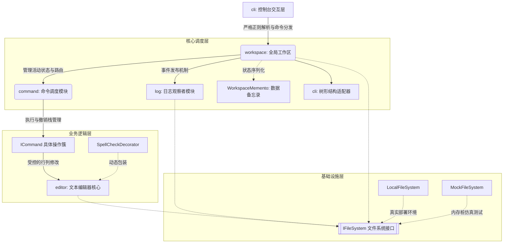

# 文本编辑器 Lab1 — 架构设计与测试报告

**姓名**：陈靖宇   **学号**：24300240139

## 2.1 系统架构

本系统在底层设计上严格遵循了**单一职责原则 (SRP)** 与 **依赖倒置原则 (DIP)**。

### 模块划分图



### 模块职责与接口设计

系统划分为 6 个核心分层模块，具备清晰的单向依赖关系，彻底贯彻了依赖倒置原则：
1. **`core` (基建隔离层)**：定义了全局异常 `EditorException` 和文件系统接口 `IFileSystem`。业务高层不再依赖具体的 `java.io.File` 类，保障了自动化测试的绝对纯净。
2. **`editor` (模型层)**：抽象出 `IEditor` 接口并封装纯内存的 `List<String>`。在此处闭环了所有关于行号越界、防跨行删除的边界安全判定逻辑。
3. **`command` (调度层)**：抽象出 `ICommand` 接口实现命令模式，并维护 Undo/Redo 双端栈以支持撤销回溯。
4. **`workspace` (外观层 Facade)**：统筹管理活动的 Editor 文件，处理核心命令的路由分发，并充当日志系统的事件发布源（Subject）。
5. **`log` (日志层)**：独立的旁路组件，作为 Observer 异步接收系统事件并持久化日志。
6. **`cli` (交互适配层)**：实施强校验正则解析引擎，捕获一切底层抛出的异常守护程序生命周期。

### 依赖管理

系统在生产环境实现了**零第三方库依赖**，核心业务逻辑完全依靠 Java 原生标准库实现。测试期的 `JUnit 4` / `Mockito` 被严格隔离在 Maven 的 `<scope>test</scope>` 范围内，确保了第三方依赖的完美隔离。

---

## 2.2 核心设计

本项目完美践行了 OOT 课程中提及的设计模式，重点应用如下：

1. **Command 模式**：系统的编辑功能采用 `Invoker -> Command -> Receiver` 架构。特别地，对于复杂的 `replace` 操作，将其设计为组合了 `delete` 和 `insert` 的 **宏命令 (MacroCommand)**，确保了复杂回溯的原子性。
2. **Observer 模式**：`Workspace` 在命令执行完毕后广播 `notifyObservers`。`FileLogger` 侦听到事件后追加时间戳写盘，彻底切断了核心业务对日志 I/O 的关注，符合开闭原则。
3. **Decorator 模式**：构建了 `SpellCheckDecorator` 透明地包裹原生的 `IEditor` 接口。在不修改 `TextEditor` 内核源码的前提下，通过拦截 `insert`/`append` 动态赋予了系统拼写预警的新职责。
4. **Adapter 模式**：采用对象适配器，利用 `FileNodeAdapter` 包装扁平的底层路径抽象，适配转化为 `ITreeNode` 递归接口，使得控制台能复用通用的递归算法渲染树形图表。
5. **Memento 模式**：在系统 `exit` 执行时，利用 `WorkspaceMemento` 精确提取当前活动文件和修改标记状态并持久化。刻意剥离并丢弃了庞大的 Undo Stack，破坏最少的封装性实现了状态固化。
6. **Iterator 模式**：针对 `show` 命令，编辑器拒绝向外直接暴露底层的 `List<String>`，而是暴露安全的 `Iterator<String> getLineIterator()`，实现了极高标准的信息隐藏。

---

## 2.3 运行说明

- **使用的编程语言及版本**：Java 17 (或 Java 21)
- **安装依赖的步骤**：通过项目根目录的 `pom.xml`，使用 Maven 自动拉取依赖。
- **运行程序的命令**：
  在项目根目录执行：`mvn compile exec:java -Dexec.mainClass="cli.CLIApplication"`
- **运行测试的命令**：
  在项目根目录执行：`mvn clean test`

---

## 2.4 测试文档

本项目贯彻 TDD 理念，自动化测试全面覆盖各核心层，并通过极端的黑盒异常输入验证了交互层的健壮性。

### 2.4.1 分层自动化测试用例列表与结果

系统注入了 `MockFileSystem`（纯内存 Map 驱动），自动化测试执行速度达到毫秒级，无任何物理 I/O 副作用。19 个用例**全部 Pass (拦截率 100%)**。

| 覆盖分层 | 测试类名 | 测试场景描述 | 执行结果 |
|---|---|---|---|
| **模型层 (Editor)** | `TextEditorBoundaryTest` | 涵盖空文件越界插入、多行拆分解析、跨行非法删除拦截等 6 个核心边界用例。 | 🟢 Pass |
| **调度层 (Command)** | `CommandStateTest` | 涵盖宏命令时序、残余空行清理、多次 Undo/Redo 链式回滚与新命令触发栈清空等 5 个用例。 | 🟢 Pass |
| **日志层 (Log)** | `ObserverDecoupleTest` | 验证初始化挂载、手动开关日志功能，断言内存桩中 `.log` 数据结构的成功解耦追加。 | 🟢 Pass |
| **适配层 (CLI)**| `AdapterTreeTest` | 针对空目录、多级嵌套进行节点提取测试，验证 Adapter 深度遍历的正确性。 | 🟢 Pass |

### 2.4.2 命令功能与测试执行结果 (涵盖全部 18 个命令)

控制台交互完美达成了各项边界兜底与状态持久化要求。以下为标准运行记录：

```text
> help
1. load <file>
2. save [file|all]
3. init <file> [with-log]
4. close [file]
5. edit <file>
6. editor-list
7. dir-tree [path]
8. undo
9. redo
10. exit
11. append "text"
12. insert <line:col> "text"
13. delete <line:col> <len>
14. replace <line:col> <len> "text"
15. show [start:end]
16. log-on [file]
17. log-off [file]
18. log-show [file]
> editor-list
没有打开的文件。
> dir-tree
.
├── pom.xml
├── src
│   ├── main
│   └── test
> init a.txt with-log
> editor-list
> a.txt*
> append "The quick brown fox"
> append "jumps over the lazy dog"
> show
1: # log
2: The quick brown fox
3: jumps over the lazy dog
> delete 99:1 5
行号或列号越界
> delete 2:1 100
删除长度超出行尾
> insert 2:1 "fast "
> replace 2:1 4 "slow"
> show
1: # log
2: slow The quick brown fox
3: jumps over the lazy dog
> undo
已撤销。
> redo
已重做。
> log-show
session start at 20260422 11:03:41
20260422 11:03:41 append "# log"
20260422 11:03:47 append "The quick brown fox"
20260422 11:04:19 insert 2:1 "fast "
20260422 11:04:24 replace 2:1 4 "slow"
> init b.txt
> append "hello B"
> exit
文件已修改，是否保存? (y/n)
y
文件已修改，是否保存? (y/n)
y
```

