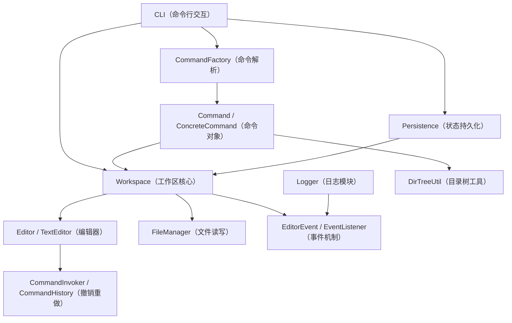

# 架构设计文档

## 2.1 系统架构

### 2.1.1 模块划分图



### 2.1.2 模块职责说明

#### 1. `cli` 模块

职责：

- 提供程序主入口和 REPL 命令行交互循环
- 读取用户输入并分发命令
- 处理 `undo`、`redo`、`exit` 等控制流程
- 负责向用户输出执行结果和错误信息

当前核心类：

- `com.editor.cli.CLI`

#### 2. `command` 模块

职责：

- 定义统一的命令抽象 `Command`
- 负责把用户输入解析成具体命令对象
- 通过 `CommandInvoker` 和 `CommandHistory` 管理可撤销命令
- 封装各类工作区命令、编辑命令和日志命令

当前核心类：

- `Command`
- `CommandFactory`
- `CommandInvoker`
- `CommandHistory`
- `command.impl.*`

#### 3. `core` 模块

职责：

- 维护工作区中的打开文件集合、当前活动文件、最近访问顺序
- 为命令模块提供统一的工作区操作接口
- 提供文本编辑器的具体实现
- 负责与文件系统交互并维护文件状态

当前核心类：

- `Workspace`
- `Editor`
- `TextEditor`
- `FileManager`

#### 4. `event` 模块

职责：

- 定义工作区事件类型与事件对象
- 提供观察者接口，解耦工作区与日志模块

当前核心类：

- `EventType`
- `EditorEvent`
- `EventListener`

#### 5. `logger` 模块

职责：

- 监听工作区发出的命令执行和文件保存事件
- 按文件写入 `.filename.log` 日志文件
- 在程序运行期间维护日志写入器，并在退出时关闭

当前核心类：

- `Logger`

#### 6. `persistence` 模块

职责：

- 在程序退出时保存工作区快照
- 在程序启动时恢复打开文件、活动文件、修改状态和日志状态
- 不保存 undo/redo 历史，符合实验要求

当前核心类：

- `Persistence`

#### 7. `utils` 模块

职责：

- 提供目录树生成等通用工具能力
- 避免将独立算法混入命令类和核心类中

当前核心类：

- `DirTreeUtil`

### 2.1.3 模块依赖关系

#### 依赖主链

- `CLI -> CommandFactory -> Command -> Workspace`
- `Workspace -> Editor`
- `Workspace -> FileManager`
- `Workspace -> Event`
- `Logger -> Event`
- `CLI -> Persistence -> Workspace`

#### 依赖关系说明

1. `CLI` 不直接操作底层文本结构，只负责交互和流程控制。
2. `CommandFactory` 只负责解析输入并创建命令，不直接保存状态。
3. `Command` 通过 `Workspace` 间接访问工作区和编辑器，降低耦合。
4. `Workspace` 是系统核心调度者，协调编辑器、文件读写、事件发布和持久化快照。
5. `Logger` 不直接侵入命令逻辑，而是通过事件机制被动监听。
6. `Persistence` 不管理业务行为，只负责快照保存与恢复。

这种依赖结构保证了：

- 交互层和业务层分离
- 文件读写和编辑逻辑分离
- 日志功能和核心功能分离
- 状态恢复和运行逻辑分离

## 2.2 核心设计

### 2.2.1 设计模式应用说明

#### 1. 命令模式（Command）

应用位置：

- `Command` 接口
- `CommandFactory`
- `CommandInvoker`
- `CommandHistory`
- 各个具体命令类

用途：

- 将用户操作封装成对象
- 统一执行入口
- 支持可撤销编辑命令

在本项目中：

- `append`、`insert`、`delete`、`replace` 等修改类命令可进入当前活动文件的历史栈
- `editor-list`、`show`、`dir-tree` 等展示类命令不进入撤销栈

#### 2. 观察者模式（Observer）

应用位置：

- `Workspace` 作为事件发布者
- `Logger` 作为事件监听者

用途：

- 当命令执行或文件保存时，向日志模块发送通知
- 解耦“业务操作”和“日志记录”

在本项目中：

- `Workspace` 通过 `publishEvent()` 广播事件
- `Logger` 根据文件是否启用日志决定是否写入日志文件

#### 3. 备忘录思想（Memento）

应用位置：

- `Workspace.WorkspaceSnapshot`
- `Persistence`

用途：

- 保存工作区的最小必要状态
- 在下次启动时恢复会话

保存内容：

- 打开的文件列表
- 当前活动文件
- 每个文件的修改标记
- 每个文件的日志开关状态

不保存内容：

- `undo/redo` 历史

#### 4. 工厂模式（Factory）

应用位置：

- `CommandFactory`

用途：

- 根据用户输入字符串创建对应的命令对象
- 统一命令的创建逻辑，避免 `CLI` 层了解具体命令类

在本项目中：

- `CommandFactory.createCommand(input)` 解析输入字符串
- 根据命令关键字返回相应的 `Command` 实例
- 降低 `CLI` 与具体命令实现的耦合度

### 2.2.2 关键设计说明

#### 1. 为什么采用 `Workspace + Editor` 两层结构

原因：

- `Workspace` 负责全局会话级状态
- `Editor` 负责单文件内容和编辑行为

这样可以自然支持：

- 多文件同时打开
- 当前活动文件切换
- 每个文件独立维护编辑状态
> 尤其是对于每个Editor可以自行维护CommandInvoker, 从而自然分别管理CommandHistory

#### 2. 为什么日志不直接写进编辑器逻辑

原因：

- 日志属于附加功能，不属于编辑器核心职责
- 如果把日志写死在编辑操作里，会让 `TextEditor` 与日志文件格式耦合

因此当前设计选择：

- 命令/保存行为发生时发布事件
- 日志模块单独监听

#### 4. 为什么持久化使用 `Properties`

原因：

- 本项目持久化状态结构简单
- 不需要额外引入 JSON 库即可完成实验要求
- 依赖更少，部署更轻量

#### 5. 关于 undo/redo 的设计选择

当前实现中：

- 每个 `Editor` 都持有自己的 `CommandInvoker`
- 当前活动文件拥有独立的撤销/重做历史

这样可以保证：

- 文件 A 的编辑历史不会污染文件 B
- `undo/redo` 语义明确绑定当前活动文件

### 2.2.3 已实现命令说明

#### 工作区命令

- `load <file>`
- `save [file|all]`
- `init <file> [with-log]`
- `close [file]`
- `edit <file>`
- `editor-list`
- `dir-tree [path]`
- `undo`
- `redo`
- `exit`

#### 文本编辑命令

- `append "text"`
- `insert <line:col> "text"`
- `delete <line:col> <len>`
- `replace <line:col> <len> "text"`
- `show [start:end]`

#### 日志命令

- `log-on [file]`
- `log-off [file]`
- `log-show [file]`


## 2.3 运行说明

### 2.3.1 使用的编程语言及版本

- 编程语言：Java
- JDK 版本：17
- 构建工具：Maven 3.9+
- 文件编码：UTF-8

### 2.3.2 安装依赖的步骤

#### 1. 安装 JDK 17

需要保证以下命令可用：

```bash
java -version
javac -version
```

#### 2. 安装 Maven

需要保证以下命令可用：

```bash
mvn -version
```

#### 3. 进入项目目录

#### 4. 下载依赖并验证环境

```bash
mvn test
```

首次执行时 Maven 会自动下载 JUnit 5 等测试依赖。

### 2.3.3 运行程序的命令

```bash
mvn -q -DskipTests package
java -cp target/classes com.editor.cli.CLI
```

### 2.3.4 运行测试的命令

```bash
mvn test
```

## 2.4 测试文档

### 2.4.1 测试用例列表

目前测试按照模块划分为 7 组，共 30 个测试。

| 测试类 | 主要覆盖内容 |
|------|------|
| `CLITest` | CLI 会话流程、`editor-list` 输出格式、未知命令错误提示、无活动文件保存错误提示 |
| `CommandFactoryTest` | 命令解析、引号与转义、未知命令、参数缺失、非法位置格式、未闭合引号 |
| `CommandHistoryTest` | 历史记录、撤销、重做、空历史场景 |
| `WorkspaceTest` | 加载新文件、保存、关闭后的活动文件切换、当前活动文件级 undo、工作区级命令不参与 undo、无活动文件/未打开文件异常 |
| `TextEditorTest` | 插入、跨行插入、删除越界、替换、显示范围、空文件插入非法位置 |
| `LoggerTest` | 日志写入、日志关闭时不写入 |
| `EditorIntegrationTest` | 命令解析-执行-日志-落盘联动，工作区状态持久化与恢复联动 |

### 2.4.2 测试执行结果

在项目根目录执行：

```bash
mvn test
```

当前测试结果：

```txt
Tests run: 30, Failures: 0, Errors: 0, Skipped: 0
BUILD SUCCESS
```

### 2.4.3 测试分层说明

本项目测试覆盖了以下层次：

#### 1. 核心单元测试

- `TextEditorTest`
- `CommandHistoryTest`

用于验证最基础的数据结构和编辑逻辑。

#### 2. 模块级测试

- `CommandFactoryTest`
- `WorkspaceTest`
- `LoggerTest`

用于验证命令解析、工作区状态管理、日志行为等模块职责。

#### 3. 协作与集成测试

- `CLITest`
- `EditorIntegrationTest`

用于验证多模块协作是否正确，包括：

- CLI 到命令执行链路
- 命令执行到日志写入链路
- 工作区状态保存与恢复链路

### 2.4.4 已覆盖的失败场景

当前测试除了正常路径外，还覆盖了多类异常和非法输入：

- 未知命令
- 命令参数缺失
- 引号未闭合
- 非法位置参数格式
- 行号/列号越界
- 显示范围非法
- 空文件非法插入位置
- 无活动文件时执行保存
- 切换到未打开文件
